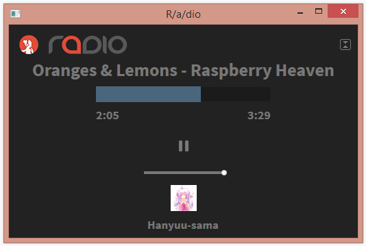
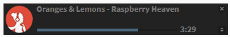
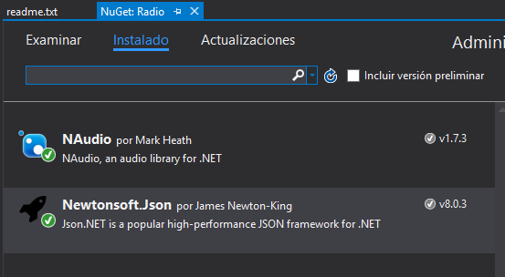
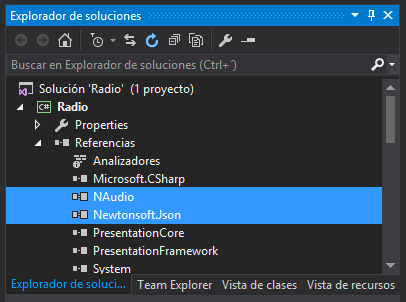

# R/a/dio player
Player for https://r-a-d.io/
A work in progress

## Dependencies
    Json.Net (http://www.newtonsoft.com/json)
	NAudio   (https://naudio.codeplex.com/)
	
## Commands / Shortcuts
    Space or ► ❚❚ to play or stop
	CTRL + SHIFT + M   to change between views.

## Screenshots

## Installation
Check the [Releases](https://github.com/yureru/R-a-dio/releases)

## Installation from source
    * Download the source, open the solution (.sln file) in Visual Studio, and click accept if shows any warning.
	
	* Click on Project tab, then click on `Manage Nuget packages`.
	
	* Search for the dependencies, and install the following libraries: NAudio, and Newtonsoft.Json. Make
	sure that both libs are installed, and the references added to the project like in the following screenshots:
	

	* Press F6 to compile.
	
	* Double click the application called `Radio` to open it. This is ubicated in the route 
	`Radio/bin/Release/`
